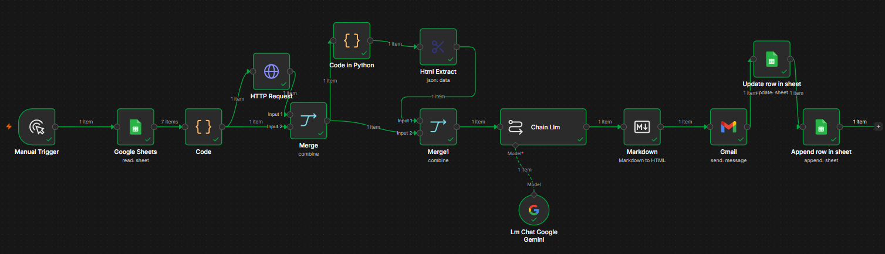

# AI-Powered Sales Prospecting Automation Agent
     

End-to-end automation system that identifies target companies, automatically researches their business, and drafts personalized sales emails using generative AI — dynamically adapting the output language based on the target market.

## Workflow Overview



## The Problem

Sales teams looking to open international markets face a classic bottleneck: manual prospecting (researching each company, writing a personalized message, sending it, following up) doesn't scale. The more companies you want to reach, the more human time you need — time that isn't spent on the conversations that actually generate value: closing meetings.

**The goal:** build a pipeline that automates the entire repetitive process (research + copywriting + delivery + logging) while preserving the quality and personalization of a hand-written message.

## How It Works

```
Google Sheets → Data Cleaning (Python) → Web Scraping → Text Extraction →
Generative AI (copywriting + language detection) → Gmail Delivery → Logging & Deduplication
```

1. **Data source**: a Google Sheet listing target companies (name, website, email, country).
2. **Validation & cleaning (Python)**: rows with invalid or missing data are discarded, inconsistent URL formats are normalized (Markdown-style links, missing protocols, etc.), and companies that were already contacted are filtered out (deduplication).
3. **Scraping**: each company's website HTML is fetched, and the meta description is extracted — the summary the company itself wrote about its business, far cleaner than raw navigation text.
4. **AI copywriting (Gemini)**: a prompt designed with B2B copywriting principles analyzes that description and drafts a short, persuasive, non-robotic email referencing real details about the prospect's business. The same prompt decides the output language based on the company's country (Spanish for Spanish-speaking markets, English otherwise).
5. **Delivery & logging**: the email is sent via Gmail, the company is marked as "contacted" to prevent duplicate outreach, and a full log (company, contact, date, content) is kept for traceability.

## Expected Source Google Sheet Structure

| Column           | Description                                                          |
|------------------|------------------------------------------------------------------------|
| `Nombre_Empresa` | Company name                                                            |
| `Web`            | Website URL (tolerates inconsistent formats: missing protocol, Markdown-style links, etc.) |
| `Email_Contacto` | Contact email                                                           |
| `País`           | Used to decide the language of the generated message                    |
| `Enviado`        | Automatically filled in after a successful send (deduplication control) |

> **Note:** the workflow requires these exact column names, since the validation script looks them up by key. The exported JSON does not include credentials or the real Sheet ID — it's shared as evidence of the system's architecture and logic, not as a ready-to-run flow without your own configuration.

## Tech Stack

- **n8n** — workflow orchestration
- **Python** — data validation, cleaning, and normalization
- **Google Sheets API** — data source and logging
- **Web Scraping (HTTP + HTML parsing)** — extracting information from websites
- **Google Gemini (LLM)** — personalized content generation
- **Gmail API** — automated sending

## Example Output

See [`examples/mail_examples.md`](./examples/mail_examples.md) for real emails generated by the system, including the automatic language switch based on the target company's country.

## Technical Challenges Solved

- **Inconsistent data normalization**: Markdown-formatted URLs, missing protocols, or malformed inputs.
- **Real-world scraping error handling**: sites with anti-bot protection, oversized HTML causing memory failures, and JavaScript-rendered pages (SPAs) that return no useful text without executing JS.
- **Input quality for the LLM**: filtering out navigation/menu noise and prioritizing the meta description as a clean context source.
- **Idempotency**: a deduplication system to prevent accidental repeat outreach to the same company.
- **Dynamic localization**: a single prompt decides the output language based on the target market, with no additional branching logic required.

## Project Status

Functional proof of concept, tested against real companies across different industries (retail, industrial engineering, technology) and countries (Argentina, Spain, United States).
