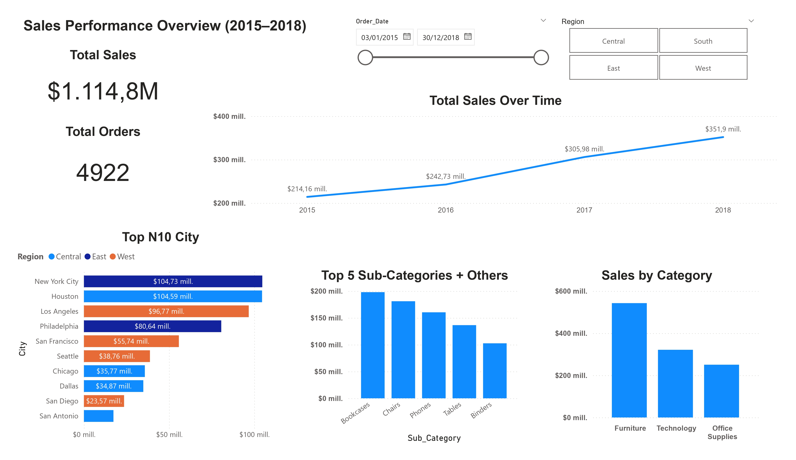

# Sales Performance Analysis

## Project Overview
This project analyzes sales performance data to identify trends, top-performing cities, and seasonal patterns.  
The objective is to transform raw sales data into actionable business insights using SQL and Power BI.

---

## Business Questions
The analysis focuses on answering the following questions:
- How have total sales evolved over time?
- Which cities generated the highest sales volume?
- Is there a relationship between geographic region and sales performance by city?
- Are there any seasonal patterns in sales?
- What insights can support better business decision-making?

---

## Tools Used
- **SQL**: Data exploration, aggregation, and trend analysis
- **Power BI**: Data visualization and dashboard creation
- **Kaggle Dataset**: Sales data source

---

## Analysis Process
1. Imported and prepared the dataset in a SQL database.
2. Used SQL queries to analyze sales by city, region, and time.
3. Created an interactive Power BI dashboard to visualize KPIs and trends.
4. Interpreted results to generate business insights and recommendations.

---

## Key Insights
- Sales show a steady upward trend over time, with significant growth toward the end of the analyzed period.
- November consistently records the highest sales, while February shows lower performance, indicating seasonality.
- Sales performance depends more on specific cities (e.g., New York City) than on regions as a whole.
- Regions with many records do not necessarily generate higher sales, suggesting opportunities to optimize resource allocation.

---

## Recommended Actions
- Strengthen marketing campaigns and inventory planning during high-performing months such as November.
- Develop targeted strategies for top-performing cities instead of focusing only on regions.
- Analyze low-performing periods (e.g., February) to design promotions that reduce seasonal drops.
- Reevaluate strategies in regions with low sales despite high presence in the dataset.

---

## Dashboard Preview

---

## Project Structure
sales-performance-analysis/
├── README.md
├── SQL/
│   └── 01_sales_analysis.sql
├── Power BI/
│   └── sales_dashboard.pbix
└── Images/
    └── dashboard_overview.jpg
    └── dashboard_details.jpg

